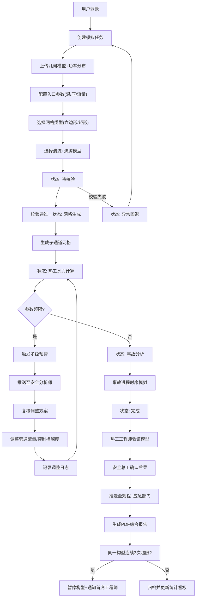

## 1. 产品概述
高精度核反应堆堆芯热工水力模拟与安全分析平台，面向核电站运行管理、核安全分析及设计验证领域，提供从几何建模到事故分析的全流程数字化仿真能力。
- 解决传统堆芯热工分析依赖经验公式、计算效率低、安全裕量评估不充分等行业痛点
- 目标用户：核安全分析师、热工工程师、安全总工、运行规程优化组、应急响应预案制定部门

## 2. 核心功能

### 2.1 用户角色
| 角色 | 注册方式 | 核心权限 |
|------|----------|----------|
| 热工工程师 | 系统分配 | 上传模型、发起模拟、验证模型合理性、提交审批 |
| 核安全分析师 | 系统分配 | 接收预警、复核超限工况、审批调整方案 |
| 安全总工 | 系统分配 | 确认事故后果、最终审批模拟结果 |
| 运行规程组 | 系统分配 | 查看通过审批的模拟结果、优化运行规程 |
| 应急响应组 | 系统分配 | 查看事故分析报告、制定应急预案 |
| 首席核安全工程师 | 系统分配 | 处理构型暂停通知、全局安全监控 |
| 系统管理员 | 系统分配 | 用户管理、权限配置、系统参数设置 |

### 2.2 功能模块
1. **首页仪表板**：任务概览、实时预警、关键指标卡片、快速操作入口
2. **模拟任务管理**：任务创建、模型上传、参数配置、任务状态流转
3. **网格构建可视化**：六边形/矩形子通道网格生成、湍流模型配置、沸腾传热关联式选择
4. **实时监控中心**：燃料芯块温度、包壳表面温度、临界热流密度比实时曲线与热力图
5. **多级预警系统**：温度超限/CHF比不足预警、预警推送、复核处理流程
6. **智能调整引擎**：旁通流量自动优化、控制棒插入深度调整、调整日志记录
7. **审批工作流**：热工工程师验证→安全总工确认→结果推送两级审批
8. **报告生成中心**：PDF综合报告、温度场切片、热流密度分布、安全裕量雷达图
9. **数据导出模块**：按功率水平/冷却剂流量/燃耗深度导出全场参数
10. **智能推荐引擎**：历史模拟分析、最优冷却剂流量分配方案推荐
11. **构型风险管控**：连续超限检测、构型自动暂停、风险通知机制
12. **综合性能看板**：每日统计、完成率分析、CHF分布、事故耗时、安全裕量雷达图

### 2.3 页面详情
| 页面名称 | 模块名称 | 功能描述 |
|----------|----------|----------|
| 首页仪表板 | 任务概览卡片 | 显示待校验/进行中/已完成/异常任务数量及趋势 |
| 首页仪表板 | 实时预警横幅 | 滚动展示最新预警信息及严重等级 |
| 首页仪表板 | 关键指标卡 | 最小CHF比、平均包壳温度、模拟完成率、平均事故分析耗时 |
| 首页仪表板 | 快速操作区 | 新建任务、查看报告、待办事项快捷入口 |
| 模拟任务列表 | 任务表格 | 任务ID、构型名称、状态、创建时间、当前步骤、负责人 |
| 模拟任务列表 | 状态筛选 | 按待校验/网格生成/热工计算/事故分析/完成/异常回退筛选 |
| 模拟任务创建 | 模型上传区 | 拖拽上传堆芯几何模型(STEP/STL)、轴向功率分布文件(CSV) |
| 模拟任务创建 | 入口参数配置 | 冷却剂温度、压力、流量滑块与数值输入 |
| 模拟任务创建 | 网格类型选择 | 六边形/矩形子通道网格切换、网格密度配置 |
| 模拟任务创建 | 物理模型选择 | 湍流模型(k-ε/k-ω/SST)、沸腾传热关联式(DNB/CHF) |
| 网格构建可视化 | 2D网格视图 | 子通道网格拓扑结构、编号、颜色编码通道类型 |
| 网格构建可视化 | 3D几何视图 | 燃料棒阵列、定位格架、通道划分立体展示 |
| 网格构建可视化 | 网格质量指标 | 正交性、长宽比、扭曲度统计直方图 |
| 热工水力计算监控 | 实时温度曲线 | 芯块中心/包壳表面/冷却剂温度多通道实时折线图 |
| 热工水力计算监控 | CHF比热力图 | 堆芯横截面CHF比分布云图、最小CHF通道高亮 |
| 热工水力计算监控 | 轴向温度切片 | 不同高度截面上的温度场彩色切片图 |
| 热工水力计算监控 | 进度条与日志 | 迭代步数、残差收敛曲线、计算日志输出 |
| 预警处理中心 | 预警列表 | 预警ID、触发条件、严重等级、所属任务、时间戳 |
| 预警处理中心 | 预警详情 | 超温通道编号、温度数值、安全限值对比、建议措施 |
| 预警处理中心 | 复核操作 | 接受/驳回调整方案、填写复核意见 |
| 调整参数面板 | 流量优化 | 旁通流量滑块、各通道流量分配建议柱状图 |
| 调整参数面板 | 控制棒调整 | 控制棒组选择、插入深度刻度调节、反应性预估 |
| 调整参数面板 | 调整日志 | 历史调整记录、调整前后参数对比、调整人签字 |
| 审批工作台 | 待审批列表 | 模型合理性验证、事故后果确认两级待办 |
| 审批工作台 | 审批详情 | 模型假设验证项、计算收敛性、参数敏感性分析 |
| 审批工作台 | 审批操作 | 通过/驳回、填写审批意见、电子签名 |
| 报告预览 | 报告目录导航 | 章节跳转、页码显示、缩放控制 |
| 报告预览 | 图表展示区 | 温度场切片、热流密度分布、CHF比曲线、事故时序图 |
| 报告预览 | 导出操作 | PDF下载、Excel数据导出、分享链接生成 |
| 智能推荐中心 | 推荐方案卡片 | 最优流量分配方案、安全裕量提升预估、置信度 |
| 智能推荐中心 | 历史相似案例 | 相同构型历史模拟结果、参数对比、成功率 |
| 智能推荐中心 | 方案应用 | 一键应用推荐参数、发起新模拟 |
| 构型风险管控 | 构型风险列表 | 构型名称、连续超限次数、风险等级、状态 |
| 构型风险管控 | 暂停详情 | 暂停原因、超限历史、处理建议、恢复申请 |
| 综合性能看板 | 完成率趋势 | 近30天模拟完成率面积图、目标线对比 |
| 综合性能看板 | CHF比分布 | 最小CHF比直方图、正态分布拟合、安全阈值线 |
| 综合性能看板 | 事故耗时分析 | 平均事故分析时长箱线图、阶段拆解柱状图 |
| 综合性能看板 | 安全裕量雷达图 | 温度裕量/CHF裕量/流量裕量/压力裕量/功率裕量多维对比 |

## 3. 核心流程
用户上传堆芯几何模型与功率分布文件，配置冷却剂入口参数后系统生成子通道网格，进入热工水力迭代计算阶段。计算过程中实时监控关键参数，若触发温度超限或CHF比不足则推送预警至核安全分析师，分析师复核后系统自动优化旁通流量或控制棒深度并重启计算。模拟完成后经两级审批（热工工程师验证→安全总工确认），生成综合PDF报告并推送至运行规程组与应急响应组。同一构型连续三次超限将自动暂停并通知首席工程师。

## 4. 用户界面设计

### 4.1 设计风格
- **主色调**：深蓝科技色(#0B1E3F) + 信号青(#00D4FF) + 警示橙(#FF8C00) + 安全绿(#00C853)
- **辅助色**：燃料红(#FF5252)用于温度超限区，紫色(#7C4DFF)用于CHF比热力图
- **按钮风格**：微立体圆角按钮，主按钮带发光边框效果，警示按钮脉冲动画
- **字体**：标题使用Orbitron增强科技感，正文使用Roboto Mono等宽字体便于数据对齐
- **布局风格**：三栏式仪表板布局（左导航+中主区+右详情），深色半透明玻璃态卡片
- **图标风格**：线性科技风图标，关键指标使用渐变填充，状态指示器带动画

### 4.2 页面设计概述
| 页面名称 | 模块名称 | UI元素 |
|----------|----------|--------|
| 首页仪表板 | 全局布局 | 左侧竖直导航栏(折叠/展开)、顶部状态栏(时钟/通知/用户)、中央卡片网格区、右侧实时预警侧边栏 |
| 首页仪表板 | 关键指标卡 | 玻璃态圆角卡片、渐变边框、实时数据跳动动画、小型趋势迷你图 |
| 首页仪表板 | 预警横幅 | 滚动走马灯、严重等级色带、点击跳转详情 |
| 模拟任务创建 | 参数配置区 | 左侧表单输入、右侧3D预览区实时联动、滑块拖动时数值同步显示 |
| 模拟任务创建 | 文件拖拽区 | 虚线边框、悬停时发光效果、文件缩略图+进度条 |
| 网格构建可视化 | 视图切换 | 2D/3D切换Tab、正交/透视视角按钮、缩放/平移/旋转控件 |
| 网格构建可视化 | 通道着色 | 按通道类型(燃料/旁通/控制棒导向管)分类着色、悬停高亮显示通道编号与参数 |
| 热工水力计算监控 | 多图布局 | 左上温度曲线、右上CHF比云图、左下轴向切片、右下收敛日志 |
| 热工水力计算监控 | 超限高亮 | 超温通道红色脉冲闪烁、CHF比<1.3区域黄色警告叠加层 |
| 预警处理中心 | 预警卡片 | 左侧严重等级色条、中间描述信息、右侧处理按钮倒计时 |
| 审批工作台 | 对比视图 | 左右分栏显示调整前后参数对比、差异值红色标记 |
| 报告预览 | 页面缩略图 | 左侧缩略图侧边栏、点击跳转、当前页高亮边框 |
| 综合性能看板 | 雷达图 | 交互式雷达图、悬停显示数值、可勾选维度切换对比对象 |

### 4.3 响应式
- 桌面端优先(1920×1080+)，支持三栏式全功能布局
- 平板端(1024×768)：右侧详情栏改为抽屉式弹出，卡片网格自适应2列
- 移动端(<768)：导航改为底部Tab，卡片单列堆叠，复杂图表简化为关键数值显示
- 触控优化：滑块增大触控区域、按钮最小高度44px、双击缩放图表

### 4.4 可视化场景指导
- **环境氛围**：深蓝渐变背景+网格线纹理，模拟核反应堆控制室氛围
- **光照设置**：卡片柔光投影、主按钮冷色发光边框、超限区域红色脉冲光晕
- **动效设计**：页面加载时卡片瀑布流依次入场(50ms间隔)、数据更新时数字滚动过渡、预警触发时全屏轻微红色闪烁
- **性能优化**：热力图使用Canvas绘制、3D视图按需加载LOD、图表使用虚拟化渲染
