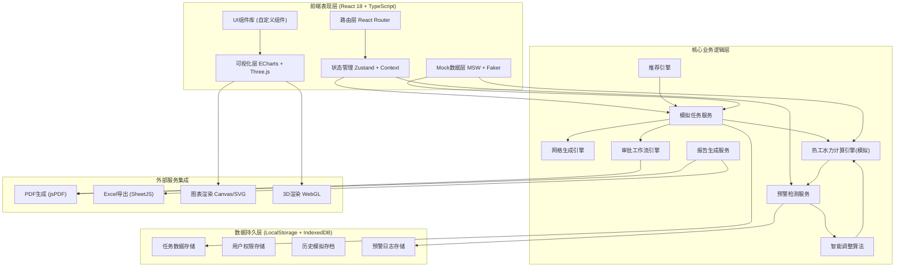
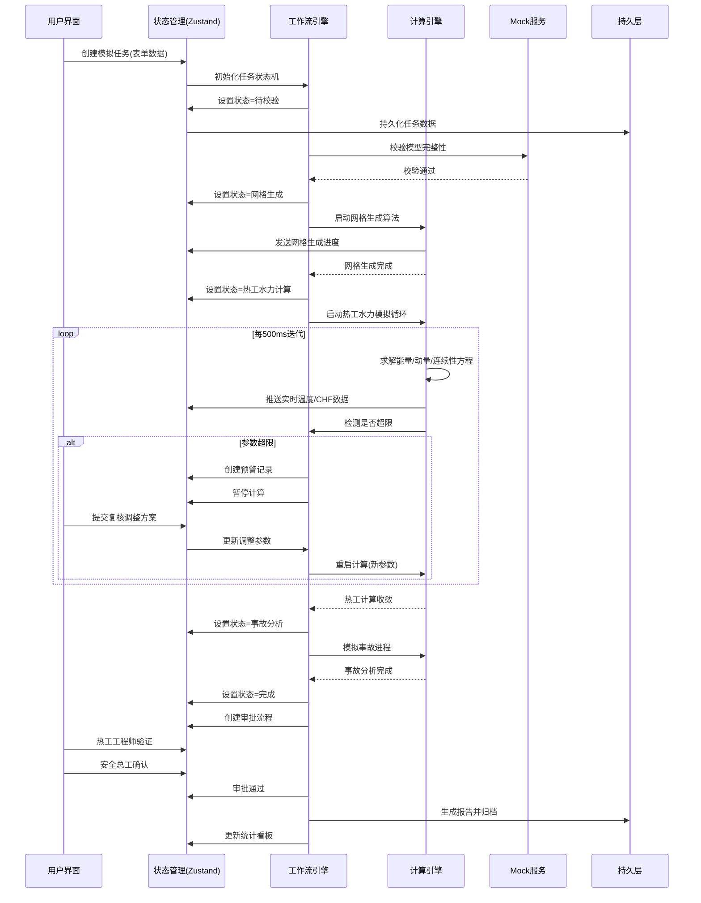
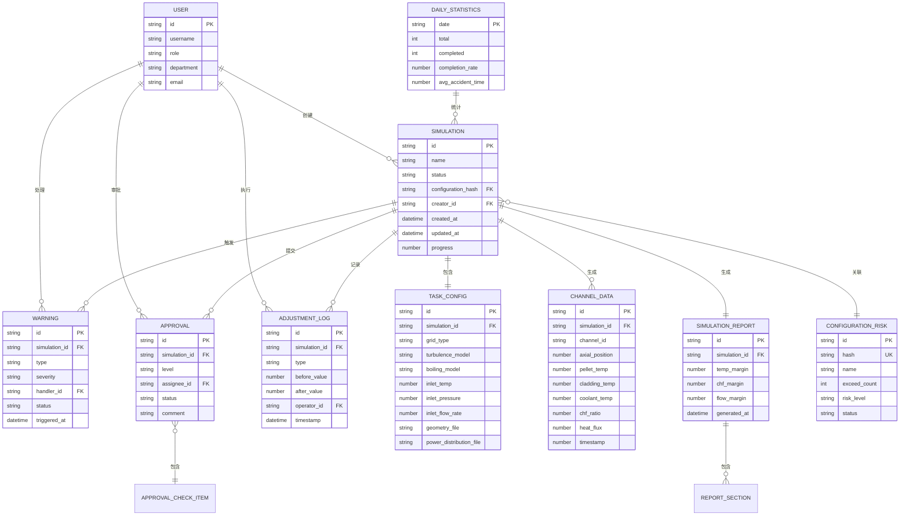

## 1. 架构设计



## 2. 技术描述
- **前端框架**: React 18 + TypeScript 5 + Vite 6
- **状态管理**: Zustand (轻量级全局状态) + React Context (主题/权限)
- **路由**: React Router v6 (嵌套路由、懒加载)
- **样式方案**: TailwindCSS 3 + CSS Modules (局部组件样式)
- **图表可视化**: ECharts 5 (折线图/热力图/雷达图/柱状图)
- **3D可视化**: Three.js + @react-three/fiber + @react-three/drei
- **UI组件**: 自研玻璃态组件库 (卡片/按钮/表单/对话框)
- **文件处理**: xlsx (Excel导入导出), jspdf + html2canvas (PDF生成)
- **Mock服务**: MSW + @faker-js/faker (模拟后端接口)
- **数据持久化**: Zustand persist + LocalStorage, IndexedDB (大型数据)
- **代码规范**: ESLint + Prettier + Husky
- **测试框架**: Vitest + @testing-library/react

## 3. 路由定义
| 路由路径 | 页面名称 | 用途 |
|----------|----------|------|
| /dashboard | 首页仪表板 | 任务概览、预警展示、关键指标 |
| /simulations | 模拟任务列表 | 任务查询、状态筛选、批量操作 |
| /simulations/new | 创建模拟任务 | 模型上传、参数配置、网格设置 |
| /simulations/:id | 模拟任务详情 | 实时监控、温度曲线、CHF云图 |
| /simulations/:id/mesh | 网格构建可视化 | 2D/3D网格视图、质量指标 |
| /simulations/:id/calculate | 热工水力计算 | 实时监控、参数曲线、日志 |
| /warnings | 预警处理中心 | 预警列表、复核处理、历史记录 |
| /approvals | 审批工作台 | 待审批项、对比视图、审批操作 |
| /reports | 报告管理 | 报告列表、预览、导出、下载 |
| /reports/:id | 报告详情 | PDF预览、图表查看、分享 |
| /recommendations | 智能推荐中心 | 方案推荐、历史案例、一键应用 |
| /configurations | 构型风险管控 | 构型风险等级、暂停管理 |
| /analytics | 综合性能看板 | 统计图表、安全裕量雷达图 |
| /settings | 系统设置 | 用户管理、权限配置、参数设置 |

## 4. 核心TypeScript类型定义

```typescript
// 模拟任务状态枚举
enum SimulationStatus {
  PENDING_VALIDATION = 'pending_validation',
  MESH_GENERATION = 'mesh_generation',
  THERMAL_CALCULATION = 'thermal_calculation',
  ACCIDENT_ANALYSIS = 'accident_analysis',
  COMPLETED = 'completed',
  EXCEPTION_ROLLBACK = 'exception_rollback',
  PAUSED = 'paused'
}

// 通道温度实时数据
interface ChannelTemperature {
  channelId: string;
  pelletCenterTemp: number;
  claddingSurfaceTemp: number;
  coolantTemp: number;
  chfRatio: number;
  heatFlux: number;
  timestamp: number;
}

// 预警信息
interface Warning {
  id: string;
  simulationId: string;
  type: 'temperature_exceed' | 'chf_below_threshold' | 'convergence_failure';
  severity: 'critical' | 'warning' | 'info';
  channelId?: string;
  actualValue: number;
  limitValue: number;
  status: 'pending' | 'reviewed' | 'resolved';
  triggeredAt: string;
  reviewedBy?: string;
  reviewComment?: string;
}

// 调整记录
interface AdjustmentLog {
  id: string;
  simulationId: string;
  type: 'bypass_flow' | 'control_rod_depth';
  beforeValue: number;
  afterValue: number;
  operator: string;
  timestamp: string;
  comment: string;
}

// 审批项
interface ApprovalItem {
  id: string;
  simulationId: string;
  level: 'engineer_verify' | 'chief_confirm';
  status: 'pending' | 'approved' | 'rejected';
  assignee: string;
  items: Array<{
    name: string;
    description: string;
    result: 'pass' | 'fail' | 'na';
    comment?: string;
  }>;
  overallComment: string;
  createdAt: string;
  signedBy?: string;
  signedAt?: string;
}

// 模拟结果报告
interface SimulationReport {
  id: string;
  simulationId: string;
  sections: Array<{
    title: string;
    type: 'text' | 'chart' | 'image' | 'table';
    content: unknown;
  }>;
  safetyMargins: {
    temperatureMargin: number;
    chfMargin: number;
    flowMargin: number;
    pressureMargin: number;
    powerMargin: number;
  };
  generatedAt: string;
  approvedBy: string[];
}

// 构型风险记录
interface ConfigurationRisk {
  id: string;
  name: string;
  hash: string;
  exceedCount: number;
  riskLevel: 'low' | 'medium' | 'high';
  status: 'active' | 'suspended';
  lastExceedAt: string;
  history: Array<{
    simulationId: string;
    exceededAt: string;
    maxTemp: number;
    minChf: number;
  }>;
}

// 每日统计
interface DailyStatistics {
  date: string;
  totalSimulations: number;
  completedSimulations: number;
  completionRate: number;
  avgAccidentAnalysisTime: number;
  minChfDistribution: number[];
  safetyMargins: SimulationReport['safetyMargins'];
}
```

## 5. 数据流架构图



## 6. 数据模型

### 6.1 实体关系图



### 6.2 核心数据存储Key设计

| Store Key | 类型 | 说明 |
|-----------|------|------|
| user:current | User | 当前登录用户信息 |
| user:list | User[] | 系统所有用户 |
| simulation:list | Simulation[] | 模拟任务列表 |
| simulation:current:id | Simulation | 当前查看的模拟任务 |
| simulation:{id}:channelData | ChannelData[] | 指定任务的通道实时数据(IndexedDB) |
| warning:list | Warning[] | 所有预警记录 |
| warning:unhandled | Warning[] | 未处理预警 |
| approval:pending | ApprovalItem[] | 待审批列表 |
| report:list | SimulationReport[] | 报告列表 |
| configuration:risk | ConfigurationRisk[] | 构型风险记录 |
| statistics:daily | DailyStatistics[] | 每日统计数据 |
| recommendation:cache | Recommendation[] | 推荐方案缓存 |
